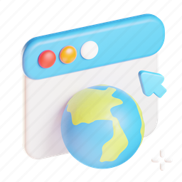

### Hi, I'm [Aeolus](https://admiring-kilby-93def3.netlify.app/) 👋
I'm a newbie JS learner and gamer.
 
`🎂` Age: 15
 
`👫` Male
 
`🛠️` Contributor In Autocode Developers
 
Discord bot: https://top.gg/bot/905703656471552021
 
Website: [https://aeolusdev.netlify.app/](https://aeolusdev.netlify.app/)

- 😄 Pronouns: He/Him
- 📫 How to reach me? [Email: aeolusdeveloper@gmail.com](aeolusdeveloper@gmail.com)

---

### Discord Status

 

### DevCard

 

### Socials

 
### Contact me : 

 

### Languages and Tools : 

 
 

---

  
:zap: GitHub Stats

 

 

